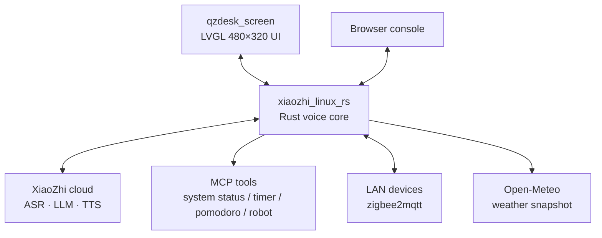

<div align="center">

</div>

<h1 align="center">QZdesk</h1>

<p align="center">A 480×320 landscape embedded AI desktop terminal: local LVGL UI + Rust voice core + importable skills</p>

<p align="center">
🇨🇳 <a href="./README.md">简体中文</a> | 🇺🇸 <a href="./README.en.md">English</a>
</p>

---

## Table of Contents

- [Introduction](#introduction)
- [Features](#features)
- [Architecture](#architecture)
- [Getting Started](#getting-started)
- [Usage](#usage)
- [Configuration](#configuration)
- [HTTP API Reference](#http-api-reference)
- [MCP Tools](#mcp-tools)
- [Project Layout](#project-layout)
- [UI & Design](#ui--design)
- [Troubleshooting](#troubleshooting)
- [Contributing](#contributing)
- [License](#license)

## Introduction

QZdesk is an AI desktop terminal that runs on an embedded Linux board. It consists of two processes:

- **`qzdesk_screen`** (C + LVGL) — a 480×320 landscape UI that owns the touch panel, fbdev, Wi-Fi, backlight and volume;
- **`xiaozhi_linux_rs`** (Rust) — the voice core that talks to the XiaoZhi cloud for real-time speech, and additionally provides an MCP gateway, local skills, smart-home control, weather, performance monitoring and a web console.

The two processes talk over local UDP, and the UI is responsible for spawning the core. A skill is a directory containing `SKILL.md`, imported from the web console; once imported it changes the assistant's persona, tone and output format — no code change or reflash required.

In one line: **a complete, trimmable embedded solution for "a desktop assistant that talks", with swappable personas and local device control.**

## Features

| Capability | Description |
| --- | --- |
| Real-time voice chat | The core connects to the XiaoZhi cloud over WebSocket; Opus encode/decode and ALSA capture/playback happen locally, with push-to-talk and interruption |
| Local skills | Import `SKILL.md` (or a ZIP containing it) from the web console; a primary skill changes the persona directly, secondary skills are retrieved on demand, and imports take effect immediately |
| MCP gateway | Exposes 12 tools to the cloud: 4 configurable external tools + 6 skill tools + 2 smart-home tools, over subprocess / HTTP / TCP |
| Smart home | The core embeds an MQTT client and talks to zigbee2mqtt or hand-written topics directly; controllable from both the web console and voice |
| Text chat | The GUI input box and the web console share one code path; text is synthesized locally and sent upstream in exactly the same frames as the microphone |
| Web console | A single-page console served by the device (default `:8080`): skills, live chat, weather, performance, smart home |
| Weather card | The core calls Open-Meteo directly (no API key); one snapshot feeds both the device home screen and the web page |
| Performance monitor | Samples `/proc` and `statvfs` every 2 seconds; the device page and the web page read the same data |
| Desktop simulator | The same code runs on a PC through the LVGL SDL simulator (480×320 window) for board-free development |
| Real hardware interfaces | Wi-Fi via `wpa_cli`, backlight via sysfs, volume via `amixer`, timezone via POSIX `TZ` — all overridable through environment variables |

## Architecture

```text
qzdesk_screen (LVGL 480×320 UI)
      ↕ UDP 5678 / 5679
xiaozhi_linux_rs (Rust voice core)
      ↕ HTTP :8080 ──── browser console
      │
      ├─ WSS audio ───→ XiaoZhi cloud (ASR · LLM · TTS)
      ├─ subprocess ──→ MCP tools (system status / timer / pomodoro / robot)
      ├─ MQTT ────────→ zigbee2mqtt / LAN devices
      └─ HTTPS ───────→ Open-Meteo (weather snapshot)
```

<details>
<summary>Expand: Mermaid version of the architecture diagram (renders as a graphic on GitHub)</summary>



<!-- Experimental: if rendering fails, preview on GitHub -->

Protocols and ports between nodes are listed in the table below. Edge labels (`-->|label|`) and `subgraph` are deliberately avoided: Mermaid draws the former as detached boxes and clips the latter.

</details>

| Channel | Port / protocol | Notes |
| --- | --- | --- |
| UI ↔ core | UDP `5678` (core) / `5679` (UI) | Chat history, state, volume & backlight, weather snapshot, performance data |
| Browser ↔ core | HTTP `8080` | The web console and its JSON API (port configurable) |
| Core ↔ cloud | WSS | XiaoZhi protocol messages: hello / listen / stt / tts (default `wss://api.tenclass.net/xiaozhi/v1/`) |
| Core ↔ LAN devices | MQTT 3.1.1 (QoS0) | Smart home |
| Core ↔ MCP tools | subprocess / HTTP / TCP | Declared in the `[mcp]` section of `config.toml` |

## Getting Started

### Prerequisites

| Dependency | Version / notes |
| --- | --- |
| CMake | ≥ 3.12.4 |
| C / C++ toolchain | Targeting ARMv7 (RV1106) or the host |
| LVGL | **9.2.3**, shipped with the repository under `third_party/` — nothing to prepare |
| Rust + Cargo | The core uses edition 2024 |
| SDL2 | Simulator only |
| ALSA development libraries | Core audio (the `alsa` crate) |
| opus / speexdsp | Native builds use the system packages (`libopus-dev`, `libspeexdsp-dev`); cross builds use the sources under `third_party/sources/` |
| Python 3 | Two MCP tool scripts (`set_timer.py`, `pomodoro.py`) |

> [!NOTE]
> LVGL 9.2.3 and the panel's `lv_conf.h` are bundled in `third_party/` (`lvgl/`, `lv_conf.h`, `conf/dev_conf.h`). The three must stay side by side — `lv_conf.h` does `#include "conf/dev_conf.h"`, so do not split them up.

> [!NOTE]
> Every third-party source tarball the cross build needs ships with the repository under `third_party/sources/` (`opus`, `speexdsp`, `alsa-lib`); `build.rs`, `build_armv7.sh` and `scripts/build_alsa.sh` all prefer them, so **those steps need no network access**. Override with `XIAOZHI_OPUS_SRC` / `XIAOZHI_SPEEXDSP_SRC` / `XIAOZHI_ALSA_SRC`. The cross toolchain itself is not vendored (~288MB) — the scripts download it only when it is missing locally.

### Run on a PC (simulator)

`run.sh` is a **development script for the PC** and only drives the simulator: it builds for the host, so its output is a plain x86 binary that the real device cannot use (see the next section for the device).

```bash
./run.sh --simulator      # 480×320 window, mouse acts as touch
```

`run.sh` frees TCP 8080 from any previous service, configures and builds `qzdesk_screen` plus the Rust core, and starts them under a small supervisor loop.

Useful switches:

| Environment variable | Effect |
| --- | --- |
| `QZDESK_BUILD_CORE=ON` | Force a core rebuild in simulator mode (otherwise `target/release` is reused) |
| `QZDESK_BUILD_DIR=...` | Build directory (default `build`) |
| `QZDESK_JOBS=N` | Number of parallel build jobs |
| `QZDESK_REPLACE_PORT_8080=0` | Do not kill the process holding port 8080 |

### Building for the device (RV1106)

The device is an ARMv7 / RV1106 Linux board: **nothing is compiled on it, and host (x86) binaries are useless on it**. Both the UI and the core come out of the Rockchip SDK.

```bash
cd <Rockchip SDK>       # not shipped with this repository — see the note below
./build.sh lunch        # first time: pick the RV1106_QZdesk + SPI_NAND board configuration
./build_qzdesk.sh       # builds the UI + cross-compiles the core, then packs output/image/update.img
```

- UI `qzdesk_screen`: built by the SDK's cross toolchain through this repository's `CMakeLists.txt` (the SDK's `project/app/qzdesk/src` points at this repository);
- Core `xiaozhi_linux_rs`: built by `xiaozhi_core/build_armv7.sh`, statically linked against musl, so the target rootfs needs no extra shared libraries;
- Output lands in the SDK's `project/app/out/bin/` and is packed into `output/image/update.img` for flashing.

> [!NOTE]
> The Rockchip SDK is a separate repository and is **not shipped here**. This repository holds only the application side (UI + core); board configuration (panel timings, partition layout, defconfig) lives in the SDK.

<details>
<summary>Expand: manual CMake commands for the simulator, and building only one part</summary>

Simulator (PC):

```bash
cmake -S . -B /tmp/qzdesk-sim-build -DQZDESK_SIMULATOR=ON
cmake --build /tmp/qzdesk-sim-build -j2
/tmp/qzdesk-sim-build/qzdesk_screen
```

Both executables land in the build directory: `qzdesk_screen` and `xiaozhi_linux_rs`.

- Core only: `cmake --build <build-dir> --target qzdesk_core_build`
- UI only: `-DQZDESK_BUILD_CORE=OFF`
- Custom Rust target triple: `-DQZDESK_CARGO_TARGET=<target>`
- `CMAKE_BUILD_TYPE` defaults to `Release` (LVGL's software renderer is noticeably slower at `-O0`); pass `Debug` explicitly when you want it

Cross-compiling only the core (without going through the SDK):

```bash
cd xiaozhi_core
bash scripts/armv7-unknown-linux-uclibceabihf/build.sh   # RV1106 + uClibc
./build_armv7.sh core                                    # or static musl
```

Deployment: put `qzdesk_screen`, `xiaozhi_linux_rs` and the runtime `xiaozhi_config.json` in the same directory on the device (the SDK uses `/oem/usr/bin/`), then start the core first and the UI second — or let the UI spawn the core (see below).

</details>

## Usage

### First activation

On start, the core performs an OTA activation check against the cloud. For the first run, open the **AI assistant** page on the device and enter the six-digit activation code shown in the chat area at `xiaozhi.me` on your phone.

### UI tour

| Page | Contents |
| --- | --- |
| Home | Status bar (time / Wi-Fi / battery) + large assistant card + settings and apps cards |
| AI assistant | Chat view ⇄ full-screen mascot view; the chat view has bubbles and an input bar, the mascot view switches between 5 expressions driven by core state |
| Apps | Skills / system status / timer / pomodoro / device control |
| Skills | Lists every skill with its primary / secondary / off state |
| Settings | WLAN scan and connect, sound, backlight, time and timezone, about |

### Working with skills

A skill is a directory containing `SKILL.md` that defines the assistant's persona, tone and output format.

1. Open `http://<device-ip>:8080` in a browser;
2. Paste the `SKILL.md` content, or upload a ZIP that contains `SKILL.md`;
3. A newly imported skill **becomes the primary skill by default** and takes effect on the next turn; you can switch it to "secondary" or "off" in the list;
4. On the device you can also switch primary / secondary / off from the **Skills** page.

The three roles behave differently:

| Role | Behaviour |
| --- | --- |
| Primary | Its body goes straight into the model context and changes persona and format from the first sentence |
| Secondary | Costs no context; retrieved via `skill_search` / `skill_read` only when relevant |
| Off | Takes no part in the conversation |

> [!NOTE]
> The primary skill body is delivered through the tool descriptions in MCP `tools/list`, not through `initialize.instructions` — the latter is ignored by some cloud gateways, whereas tool descriptions always reach the model context. It is sent once per session, and the core rebuilds the session when skills change.

### Web console

Default address `http://<device-ip>:8080`; change the port with `QZDESK_SKILL_WEB_PORT` (or `XIAOZHI_SKILL_WEB_PORT`). The page offers skill management and editing, live chat (pushed over SSE), weather, performance monitoring and smart-home control.

## Configuration

Configuration lives in two layers:

| File | When | Contents |
| --- | --- | --- |
| `xiaozhi_core/config.toml` | Compile time: embedded into the binary by `build.rs` | Defaults (application info, audio, network, TTS, MCP, smart home, weather) |
| `xiaozhi_config.json` | Runtime: generated on first start | Writable configuration; restart to apply |

Frequently used environment variables (they take precedence over the config files):

| Environment variable | Effect |
| --- | --- |
| `QZDESK_SKILL_WEB_PORT` / `XIAOZHI_SKILL_WEB_PORT` | Web console port (default 8080) |
| `QZDESK_SKILL_DIR` / `QZDESK_SKILL_SOURCE_DIR` | Skill directory / read-only skill source directory |
| `QZDESK_CORE_AUTOSTART=0` | Do not let the UI spawn the core |
| `QZDESK_CORE_BIN` | Path to the core executable |
| `QZDESK_CORE_HOST` / `QZDESK_CORE_PORT` / `QZDESK_CORE_GUI_PORT` | Local IPC addresses (defaults `127.0.0.1`, `5678`, `5679`) |
| `QZDESK_TTS_APP_ID` / `_API_KEY` / `_API_SECRET` / `_VOICE` / `_SPEED` / `_VOLUME` / `_PITCH` / `_ENABLE=0` | Online text-to-speech |
| `QZDESK_SMARTHOME_ENABLE` / `_BROKER` / `_USER` / `_PASSWORD` / `_Z2M_TOPIC` | Smart-home MQTT |
| `WEATHER_LATITUDE` / `WEATHER_LONGITUDE` / `WEATHER_CITY` / `WEATHER_ENABLE=0` | Weather card |
| `QZDESK_MATERIAL_OPA` / `QZDESK_GLASS_OPA` | UI material opacity (0–100%, default 90%) |
| `QZDESK_REDUCE_MOTION=1` | Disable entrance and transition animations |
| `QZDESK_WIFI_IFACE` / `QZDESK_WPA_CONF` / `QZDESK_BACKLIGHT` / `QZDESK_TZ_PROFILE` | Override hardware paths on a different board or for local testing |
| `QZDESK_AUDIO_DISABLED=1` | Do not start ALSA capture/playback (on by default in the simulator) |

> [!WARNING]
> `config.toml` holds compile-time defaults and must be committed, so **never** put real cloud credentials in it. Pass every secret through the environment variables above and keep placeholders (such as `<YOUR_APP_ID>`) in the file.

## HTTP API Reference

Every capability of the web console is served by these JSON endpoints (`xiaozhi_core/src/skill_web.rs`); the device-side skills page uses the same API.

| Method | Path | Description |
| --- | --- | --- |
| `GET` | `/` | The console single page |
| `GET` | `/api/skills` | Skill list, each skill's `role`, and `summary.{primary,secondary,version}` |
| `POST` | `/api/skills` | Install/overwrite `SKILL.md` with JSON `{name, content}` |
| `POST` | `/api/skills/upload` | Upload a ZIP containing `SKILL.md` |
| `GET` | `/api/skills/<id>/content` | Read the raw `SKILL.md` |
| `PUT` | `/api/skills/<id>/selection` | Set the role: `{"role":"primary"\|"secondary"\|"none"}` |
| `DELETE` | `/api/skills/<id>` | Delete a user-installed skill |
| `POST` | `/api/chat/send` | Send a text message (synthesized locally and sent upstream), returns `202` |
| `GET` | `/api/chat/stream` | Live chat stream (SSE) |
| `GET` | `/api/chat/history` | Existing chat history |
| `GET` | `/api/weather` | Weather snapshot |
| `POST` | `/api/weather/refresh` | Refresh the weather now |
| `GET` | `/api/performance` | Performance snapshot |
| `GET` | `/api/performance/history` | Performance history for charts |
| `GET` | `/api/devices` | LAN device table |
| `POST` | `/api/devices/discover` | Trigger device discovery |
| `POST` | `/api/devices/command` | Control a device: `{id, action, value}` |
| `GET` / `PUT` | `/api/smarthome` | Read / update the MQTT hub configuration |

## MCP Tools

The core exposes 12 MCP tools to the cloud (`tools/list`), registered from the `[mcp]` section of `config.toml` plus built-in modules:

| Tool | Source | Description |
| --- | --- | --- |
| `get_system_status` | `system_status.sh` | CPU load, memory, disk, uptime |
| `robot_move` | `robot_move.sh` | Robot motion control (forward / backward / left / right / stop) |
| `set_timer` | `set_timer.py` | Create a timer reminder (supports a daily repeat) |
| `pomodoro` | `pomodoro.py` | Pomodoro timer |
| `skill_list` / `skill_search` / `skill_read` | built-in | List / search / read local skills |
| `skill_status` / `skill_validate` / `skill_reload` | built-in | Skill diagnostics, validation and rescan |
| `device_list` / `device_control` | built-in | Smart-home device listing and control |

Transports, execution modes (`sync` / `background`) and timeouts for external tools are declared in `config.toml`; see [`xiaozhi_core/docs/MCP功能说明.md`](./xiaozhi_core/docs/MCP功能说明.md) (Chinese).

## Project Layout

```text
├── app/                      # LVGL UI: main loop, theme, mascot, config, Wi-Fi, core process management
├── pages/                    # Home / assistant / apps / skills / settings / weather / performance
├── include/                  # Public interfaces of each module
├── assets/                   # Mascot and icon source images
├── docs/                     # UI and design notes
├── tools/                    # Python bake scripts for mascot and icons
├── xiaozhi_core/             # Rust voice core (MIT)
│   ├── src/                  # Audio, network, controller, MCP gateway, skills, weather, smart home…
│   ├── web/                  # Web console (single HTML file)
│   ├── docs/                 # MCP / OTA / audio device / GUI adaptation notes
│   └── scripts/              # Includes the RV1106 uClibc cross-compilation script
├── run.sh                    # PC simulator: one-command build + run (the device goes through the SDK)
├── CMakeLists.txt
└── LICENSE                   # MIT
```

## UI & Design

The UI follows Apple's light-mode HIG. All design tokens live in `include/theme.h`, and animation curves and durations are collected there too. The full story — palette, material opacity, mascot bitmap baking, memory and rendering trade-offs, performance tuning — is in [`docs/UI与设计.md`](./docs/UI与设计.md) (Chinese).

A few constraints worth knowing up front:

- 480×320 at 16-bit colour depth; `LV_MEM_SIZE` in `lv_conf.h` is 2MB;
- Do not animate scale or rotation on large objects (LVGL allocates a full ARGB layer for them, which easily fails on the embedded heap);
- Panel size is set in the SDK device tree; when changing panels, keep `QZ_SCREEN_W/H` in sync with it.

## Troubleshooting

> [!TIP]
> When a skill seems not to apply, have the assistant call `skill_status` or `skill_list` and trust the real return value rather than the UI impression.

| Symptom | What to check |
| --- | --- |
| UI feels sluggish | Make sure it is a Release build (LVGL's software renderer is several times slower at `-O0`); delete and recreate an old `build/` directory |
| Text chat does nothing | A working text-to-speech configuration is required (`QZDESK_TTS_*`); the UI reports it when synthesis is unavailable |
| Web console unreachable | Check whether the port is taken (`run.sh` tries to free 8080) or set `QZDESK_SKILL_WEB_PORT` |
| Core will not start | `QZDESK_CORE_AUTOSTART`, `QZDESK_CORE_BIN`, and `xiaozhi_config.json` next to the core |
| No sound in the simulator | The simulator sets `QZDESK_AUDIO_DISABLED=1` by default (no ALSA devices) — expected |

## Contributing

- Make sure `cargo test` passes (core side) and that the UI still starts in the simulator;
- UI changes must follow the design tokens and motion rules in `include/theme.h` — do not hard-code colours or durations inside pages;
- Add new skills as standalone directories with a `SKILL.md` instead of modifying core code.

## License

This project is released under the **MIT** license; see [`LICENSE`](./LICENSE).

The bundled voice core in `xiaozhi_core/` is MIT as well (Copyright © 2025 Hyrsoft); see [`xiaozhi_core/LICENSE`](./xiaozhi_core/LICENSE).
