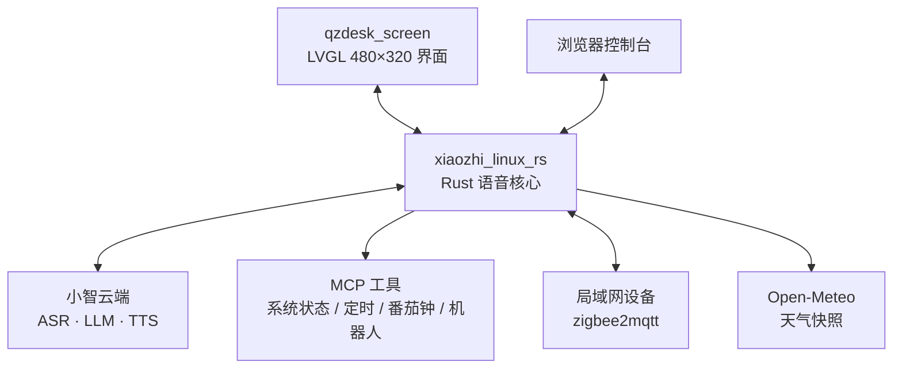

<div align="center">

</div>

<h1 align="center">QZdesk</h1>

<p align="center">一块 480×320 横屏嵌入式 AI 桌面终端：本地 LVGL 界面 + Rust 语音核心 + 可导入的技能</p>

<p align="center">
🇨🇳 <a href="./README.md">简体中文</a> | 🇺🇸 <a href="./README.en.md">English</a>
</p>

---

## 目录

- [项目简介](#项目简介)
- [功能特性](#功能特性)
- [系统架构](#系统架构)
- [快速开始](#快速开始)
- [使用](#使用)
- [配置](#配置)
- [HTTP API 参考](#http-api-参考)
- [MCP 工具](#mcp-工具)
- [目录结构](#目录结构)
- [界面与设计](#界面与设计)
- [排查](#排查)
- [贡献](#贡献)
- [许可证](#许可证)

## 项目简介

QZdesk 是一台跑在 Linux 嵌入式板上的 AI 桌面终端，由两个进程组成：

- **`qzdesk_screen`**（C + LVGL）——480×320 横屏界面，管触摸、fbdev、Wi-Fi、背光、音量；
- **`xiaozhi_linux_rs`**（Rust）——语音核心，接小智云端做实时语音对话，并对外提供 MCP 网关、本地技能、智能家居、天气、性能监控与一个网页控制台。

两个进程通过本机 UDP 通信，界面负责拉起核心。技能（Skill）以 `SKILL.md` 为单位从网页控制台导入，导入后即可改变 AI 的人格、语气与输出格式，无需改代码或重新烧录。

一句话定位：**把「会说话的桌面助手」做成可裁剪、可换人设、可接本地设备的嵌入式整机方案。**

## 功能特性

| 能力 | 说明 |
| --- | --- |
| 实时语音对话 | 核心经 WebSocket 接小智云端，本地做 Opus 编解码与 ALSA 采集/播放，支持按住说话与打断 |
| 本地技能（Skill） | 网页控制台导入 `SKILL.md`（或含 `SKILL.md` 的 ZIP）；主技能直接改变人格，备用技能按需检索；导入即生效 |
| MCP 网关 | 对云端暴露 12 个工具：4 个可配置外部工具 + 6 个技能工具 + 2 个智能家居工具，支持 subprocess / HTTP / TCP 三种传输 |
| 智能家居 | 核心内置 MQTT 客户端，直接对接 zigbee2mqtt 或手写主题的局域网设备，网页与语音都能控制 |
| 文字聊天 | GUI 输入框与网页控制台共用一个入口；文字先在本地合成语音，再按麦克风同样的报文发给云端 |
| 网页控制台 | 设备自带的单页控制台（默认 `:8080`）：技能管理、实时聊天、天气、性能、智能家居 |
| 天气卡片 | 核心直接请求 Open-Meteo（无需 Key），一份快照同时供设备首页与网页 |
| 性能监控 | 每 2 秒采样 `/proc` 与 `statvfs`，设备页与网页读同一份数据 |
| 桌面模拟器 | 同一份代码在 PC 上用 LVGL SDL 模拟器运行（480×320 窗口），便于无板开发 |
| 无板硬件接口 | Wi-Fi 走 `wpa_cli`、背光写 sysfs、音量走 `amixer`、时区写 POSIX `TZ`，全部可用环境变量覆盖 |

## 系统架构

```text
qzdesk_screen（LVGL 480×320 界面）
      ↕ UDP 5678 / 5679
xiaozhi_linux_rs（Rust 语音核心）
      ↕ HTTP :8080 ──── 浏览器控制台
      │
      ├─ WSS 音频 ───→ 小智云端（ASR · LLM · TTS）
      ├─ 子进程 ─────→ MCP 工具（系统状态 / 定时 / 番茄钟 / 机器人）
      ├─ MQTT ───────→ zigbee2mqtt / 局域网设备
      └─ HTTPS ──────→ Open-Meteo（天气快照）
```

<details>
<summary>展开：Mermaid 版架构图（在 GitHub 上会渲染成图形）</summary>



<!-- Experimental: if rendering fails, preview on GitHub -->

节点之间的协议与端口见下方表格。刻意不加边标签（`-->|标签|`）也不套 `subgraph`：这两者会让 Mermaid 把标签画成游离方块、把子图裁掉。

</details>

| 通道 | 端口 / 协议 | 说明 |
| --- | --- | --- |
| 界面 ↔ 核心 | UDP `5678`（核心监听）/ `5679`（界面监听） | 聊天记录、状态、音量背光、天气快照、性能数据 |
| 浏览器 ↔ 核心 | HTTP `8080` | 网页控制台与其 JSON API（可改端口） |
| 核心 ↔ 云端 | WSS | 小智协议的 hello / listen / stt / tts 报文（默认 `wss://api.tenclass.net/xiaozhi/v1/`） |
| 核心 ↔ 局域网设备 | MQTT 3.1.1 (QoS0) | 智能家居 |
| 核心 ↔ MCP 工具 | 子进程 / HTTP / TCP | 由 `config.toml` 的 `[mcp]` 声明 |

## 快速开始

### 前置依赖

| 依赖 | 版本 / 说明 |
| --- | --- |
| CMake | ≥ 3.12.4 |
| C / C++ 工具链 | 目标为 ARMv7（RV1106）或本机 |
| LVGL | **9.2.3**，已随仓库提供（`third_party/`），无需单独准备 |
| Rust + Cargo | 核心使用 edition 2024 |
| SDL2 | 仅模拟器需要 |
| ALSA 开发库 | 核心音频（`alsa` crate） |
| opus / speexdsp | 本机编译用系统开发包（`libopus-dev`、`libspeexdsp-dev`）；交叉编译用仓库内 `third_party/sources/` 的源码 |
| Python 3 | 两个 MCP 工具脚本（`set_timer.py`、`pomodoro.py`） |

> [!NOTE]
> LVGL 9.2.3 与面板的 `lv_conf.h` 直接内置在 `third_party/`（`lvgl/`、`lv_conf.h`、`conf/dev_conf.h`）。三者必须保持同级——`lv_conf.h` 里有 `#include "conf/dev_conf.h"`，调整时不要拆开。

> [!NOTE]
> 交叉编译需要的第三方源码包都随仓库提供在 `third_party/sources/`（`opus`、`speexdsp`、`alsa-lib`），`build.rs`、`build_armv7.sh` 与 `scripts/build_alsa.sh` 都优先用它，这几步**不再联网**；可用 `XIAOZHI_OPUS_SRC` / `XIAOZHI_SPEEXDSP_SRC` / `XIAOZHI_ALSA_SRC` 指向自备的包覆盖。交叉工具链本身不入库（约 288MB），脚本只在本地没有时才下载。

### 在 PC 上运行（模拟器）

`run.sh` 是**开发用的 PC 脚本**，只用来跑模拟器：它按宿主机编译，产物是普通的 x86 二进制，真机用不上（真机构建见下一节）。

```bash
./run.sh --simulator      # 480×320 窗口，鼠标模拟触摸
```

`run.sh` 会依次：关掉占用 TCP 8080 的旧服务 → 配置并编译 `qzdesk_screen` 与 Rust 核心 → 带守护循环启动。

常用开关：

| 环境变量 | 作用 |
| --- | --- |
| `QZDESK_BUILD_CORE=ON` | 模拟器下强制重新编译 Rust 核心（默认复用 `target/release`） |
| `QZDESK_BUILD_DIR=...` | 指定构建目录（默认 `build`） |
| `QZDESK_JOBS=N` | 并行编译任务数 |
| `QZDESK_REPLACE_PORT_8080=0` | 不自动关闭占用 8080 的旧进程 |

### 真机（RV1106）构建

真机是 ARMv7 / RV1106 的 Linux 板子：**不在设备上编译，也不用宿主机（x86）的产物**，界面与核心都从 Rockchip SDK 里出。

```bash
cd <Rockchip SDK>       # 本仓库不含 SDK，需另行准备
./build.sh lunch        # 首次：选板级 RV1106_QZdesk + SPI_NAND
./build_qzdesk.sh       # 编界面 + 交叉编核心，最后打包 output/image/update.img
```

- 界面 `qzdesk_screen`：由 SDK 的交叉工具链经本仓库的 `CMakeLists.txt` 编出（SDK 里 `project/app/qzdesk/src` 指向本仓库）；
- 核心 `xiaozhi_linux_rs`：走 `xiaozhi_core/build_armv7.sh`，静态 musl 链接，目标 rootfs 不需要额外动态库；
- 产物落在 SDK 的 `project/app/out/bin/`，再打包成 `output/image/update.img` 烧到板子上。

> [!NOTE]
> Rockchip SDK 是独立仓库，**不随本仓库提供**。本仓库只有应用侧代码（界面 + 核心）；板级配置（面板时序、分区表、defconfig）都在 SDK 里。

<details>
<summary>展开：模拟器的手工 CMake 命令、以及只编某一部分</summary>

模拟器（PC）：

```bash
cmake -S . -B /tmp/qzdesk-sim-build -DQZDESK_SIMULATOR=ON
cmake --build /tmp/qzdesk-sim-build -j2
/tmp/qzdesk-sim-build/qzdesk_screen
```

两个可执行文件都会生成在构建目录：`qzdesk_screen` 与 `xiaozhi_linux_rs`。

- 只编译核心：`cmake --build <build-dir> --target qzdesk_core_build`
- 只编译界面：`-DQZDESK_BUILD_CORE=OFF`
- 指定 Rust 目标三元组：`-DQZDESK_CARGO_TARGET=<target>`
- 默认 `CMAKE_BUILD_TYPE=Release`（LVGL 软件渲染在 `-O0` 下会明显卡顿），需调试请显式传 `Debug`

只交叉编译核心（不经过 SDK 时）：

```bash
cd xiaozhi_core
bash scripts/armv7-unknown-linux-uclibceabihf/build.sh   # RV1106 + uClibc
./build_armv7.sh core                                    # 或静态 musl
```

部署：把 `qzdesk_screen`、`xiaozhi_linux_rs` 与运行时配置 `xiaozhi_config.json` 放到设备同一目录（SDK 默认 `/oem/usr/bin/`），先起核心再起界面；也可让界面自动拉起核心（见下）。

</details>

## 使用

### 首次激活

核心启动后会向云端做 OTA 激活检查。首次运行请进入设备的 **AI 助手** 页面，在手机端打开 `xiaozhi.me` 输入聊天区显示的六位激活码。

### 界面导览

| 页面 | 内容 |
| --- | --- |
| 主页 | 状态栏（时间 / Wi-Fi / 电量）+ AI 助手大卡片 + 设置、应用卡片 |
| AI 对话页 | 聊天框 ⇄ 全屏表情双模式；聊天框为气泡 + 输入栏，全屏表情随核心状态切换 5 种表情 |
| 应用 | 技能 / 系统状态 / 定时提醒 / 番茄钟 / 设备控制 |
| 技能 | 列出每个 Skill 的主技能 / 备用 / 关闭状态 |
| 设置 | WLAN 扫描与连接、声音、背光、时间与时区、关于 |

### 使用技能

技能是一个含 `SKILL.md` 的目录，用它来规定 AI 的人格、语气与输出格式。

1. 浏览器打开 `http://<设备IP>:8080`；
2. 在上传区粘贴 `SKILL.md` 内容，或上传包含 `SKILL.md` 的 ZIP；
3. 新导入的技能**默认就是主技能**，下一轮对话即生效；可在列表里改成「备用」或「关闭」；
4. 设备端也可在「技能」页切换主 / 备 / 关闭。

主技能与备用技能的行为不同：

| 角色 | 行为 |
| --- | --- |
| 主技能 | 正文直接进入模型上下文，从第一句话起改变人格与格式 |
| 备用 | 不占上下文，问题相关时才被 `skill_search` / `skill_read` 检索 |
| 关闭 | 完全不参与对话 |

> [!NOTE]
> 主技能正文是通过 MCP `tools/list` 的工具描述下发的，而不是 `initialize.instructions` —— 后者在部分云端网关上会被忽略，而工具描述一定会进模型上下文。会话建立时下发一次，技能变更后核心会自动重建会话。

### Web 控制台

默认地址 `http://<设备IP>:8080`，端口可用 `QZDESK_SKILL_WEB_PORT`（或 `XIAOZHI_SKILL_WEB_PORT`）修改。页面上有：技能管理与编辑、实时聊天（SSE 推送）、天气、性能监控、智能家居。

## 配置

配置分两层：

| 文件 | 时机 | 内容 |
| --- | --- | --- |
| `xiaozhi_core/config.toml` | 编译期：由 `build.rs` 嵌入二进制 | 默认值（应用信息、音频、网络、TTS、MCP、智能家居、天气） |
| `xiaozhi_config.json` | 运行时：首次启动自动生成 | 可写配置，改完重启生效 |

常用环境变量（优先级高于配置文件）：

| 环境变量 | 作用 |
| --- | --- |
| `QZDESK_SKILL_WEB_PORT` / `XIAOZHI_SKILL_WEB_PORT` | 网页控制台端口（默认 8080） |
| `QZDESK_SKILL_DIR` / `QZDESK_SKILL_SOURCE_DIR` | 技能目录 / 只读技能源目录 |
| `QZDESK_CORE_AUTOSTART=0` | 不让界面自动拉起核心 |
| `QZDESK_CORE_BIN` | 指定核心可执行文件路径 |
| `QZDESK_CORE_HOST` / `QZDESK_CORE_PORT` / `QZDESK_CORE_GUI_PORT` | 核心与界面的本机通信地址（默认 `127.0.0.1`、`5678`、`5679`） |
| `QZDESK_TTS_APP_ID` / `_API_KEY` / `_API_SECRET` / `_VOICE` / `_SPEED` / `_VOLUME` / `_PITCH` / `_ENABLE=0` | 在线语音合成 |
| `QZDESK_SMARTHOME_ENABLE` / `_BROKER` / `_USER` / `_PASSWORD` / `_Z2M_TOPIC` | 智能家居 MQTT |
| `WEATHER_LATITUDE` / `WEATHER_LONGITUDE` / `WEATHER_CITY` / `WEATHER_ENABLE=0` | 天气卡片 |
| `QZDESK_MATERIAL_OPA` / `QZDESK_GLASS_OPA` | 界面材质通透度（0–100%，默认 90%） |
| `QZDESK_REDUCE_MOTION=1` | 关闭入场与切换动效 |
| `QZDESK_WIFI_IFACE` / `QZDESK_WPA_CONF` / `QZDESK_BACKLIGHT` / `QZDESK_TZ_PROFILE` | 换板或本地验证时覆盖硬件路径 |
| `QZDESK_AUDIO_DISABLED=1` | 不启动 ALSA 采集/播放（模拟器默认开启） |

> [!WARNING]
> `config.toml` 是编译期默认值、需要入库，请**不要**在里面写真实的云服务密钥。所有密钥都改用上面的环境变量传入，文件里保留占位符（如 `<YOUR_APP_ID>`）。

## HTTP API 参考

网页控制台的所有能力都由这些 JSON 接口提供（`xiaozhi_core/src/skill_web.rs`），设备端的技能页也读同一套接口。

| 方法 | 路径 | 说明 |
| --- | --- | --- |
| `GET` | `/` | 控制台单页 |
| `GET` | `/api/skills` | 技能列表、每个技能的 `role`、`summary.{primary,secondary,version}` |
| `POST` | `/api/skills` | 以 JSON `{name, content}` 安装/覆盖 `SKILL.md` |
| `POST` | `/api/skills/upload` | 上传含 `SKILL.md` 的 ZIP |
| `GET` | `/api/skills/<id>/content` | 读取 `SKILL.md` 原文 |
| `PUT` | `/api/skills/<id>/selection` | 设置角色：`{"role":"primary"\|"secondary"\|"none"}` |
| `DELETE` | `/api/skills/<id>` | 删除用户安装的技能 |
| `POST` | `/api/chat/send` | 发送一条文字（本地合成语音后上行），返回 `202` |
| `GET` | `/api/chat/stream` | 聊天记录实时流（SSE） |
| `GET` | `/api/chat/history` | 现有聊天记录 |
| `GET` | `/api/weather` | 天气快照 |
| `POST` | `/api/weather/refresh` | 立即刷新天气 |
| `GET` | `/api/performance` | 性能快照 |
| `GET` | `/api/performance/history` | 性能历史曲线数据 |
| `GET` | `/api/devices` | 局域网设备表 |
| `POST` | `/api/devices/discover` | 触发设备发现 |
| `POST` | `/api/devices/command` | 控制设备：`{id, action, value}` |
| `GET` / `PUT` | `/api/smarthome` | 读取 / 修改 MQTT 中枢配置 |

## MCP 工具

核心对云端暴露 12 个 MCP 工具（`tools/list`），由 `config.toml` 的 `[mcp]` 与内置模块注册：

| 工具 | 来源 | 说明 |
| --- | --- | --- |
| `get_system_status` | `system_status.sh` | CPU 负载、内存、磁盘、运行时间 |
| `robot_move` | `robot_move.sh` | 机器人运动控制（forward / backward / left / right / stop） |
| `set_timer` | `set_timer.py` | 新建定时提醒（支持每日重复） |
| `pomodoro` | `pomodoro.py` | 番茄钟 |
| `skill_list` / `skill_search` / `skill_read` | 内置 | 列出 / 检索 / 读取本地技能 |
| `skill_status` / `skill_validate` / `skill_reload` | 内置 | 技能体检、校验与重新扫描 |
| `device_list` / `device_control` | 内置 | 智能家居设备列表与控制 |

外部工具的传输方式、执行模式（`sync` / `background`）与超时都在 `config.toml` 里声明，详见 [`xiaozhi_core/docs/MCP功能说明.md`](./xiaozhi_core/docs/MCP功能说明.md)。

## 目录结构

```text
├── app/                      # LVGL 界面：主循环、主题、表情、配置、Wi-Fi、核心进程管理
├── pages/                    # 主页 / 助手 / 应用 / 技能 / 设置 / 天气 / 性能
├── include/                  # 各模块公开接口
├── assets/                   # 吉祥物表情与图标原图
├── docs/                     # 界面与设计说明
├── tools/                    # 表情图与图标烘焙脚本（Python）
├── xiaozhi_core/             # Rust 语音核心（MIT）
│   ├── src/                  # 音频、网络、控制器、MCP 网关、技能、天气、智能家居…
│   ├── web/                  # 网页控制台（单文件 HTML）
│   ├── docs/                 # MCP / OTA / 音频设备 / GUI 适配说明
│   └── scripts/              # 含 RV1106 uClibc 交叉编译脚本
├── run.sh                    # PC 模拟器：一键构建 + 运行（真机走 SDK 交叉编译）
├── CMakeLists.txt
└── LICENSE                   # MIT
```

## 界面与设计

界面按 Apple HIG 浅色系统实现，全部设计令牌集中在 `include/theme.h`，动效曲线与时长同样收敛在那里。配色、材质通透度、吉祥物位图烘焙、内存与渲染取舍、性能调优手段等完整说明见 [`docs/UI与设计.md`](./docs/UI与设计.md)。

几个值得先知道的约束：

- 480×320、16 位色深；`lv_conf.h` 的 `LV_MEM_SIZE` 为 2MB；
- 大尺寸对象不要做缩放/旋转动画（LVGL 会申请整块 ARGB 图层，嵌入式堆上容易分配失败）；
- 面板尺寸在 SDK 设备树里设置，改屏时需保证 `QZ_SCREEN_W/H` 与面板一致。

## 排查

> [!TIP]
> 技能「像没生效」时，让助手调用 `skill_status` 或 `skill_list` 看真实返回值，而不是靠界面印象判断。

| 现象 | 排查方向 |
| --- | --- |
| 界面卡顿 | 确认是 Release 构建（`-O0` 下 LVGL 软件渲染会慢数倍）；旧 `build/` 目录请删掉重建 |
| 文字聊天没反应 | 需要可用的语音合成配置（`QZDESK_TTS_*`）；合成不可用时界面会提示 |
| 网页控制台打不开 | 检查端口是否被占用（`run.sh` 会尝试释放 8080），或改 `QZDESK_SKILL_WEB_PORT` |
| 核心起不来 | `QZDESK_CORE_AUTOSTART`、`QZDESK_CORE_BIN` 与核心同目录的 `xiaozhi_config.json` |
| 模拟器无声 | 模拟器默认 `QZDESK_AUDIO_DISABLED=1`（无 ALSA 设备），属预期 |

## 贡献

- 提交前请保证 `cargo test` 通过（核心侧），并确认界面在模拟器下可正常启动；
- 界面改动请遵循 `include/theme.h` 里的设计令牌与动效规范，不要在页面里硬编码颜色或时长；
- 新增技能请提交为独立目录 + `SKILL.md`，不要改动核心代码。

## 许可证

本项目以 **MIT** 许可发布，详见 [`LICENSE`](./LICENSE)。

内置的语音核心 `xiaozhi_core/` 同样采用 MIT（Copyright © 2025 Hyrsoft），详见 [`xiaozhi_core/LICENSE`](./xiaozhi_core/LICENSE)。
